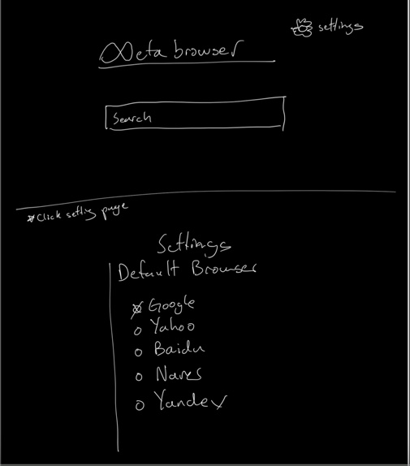
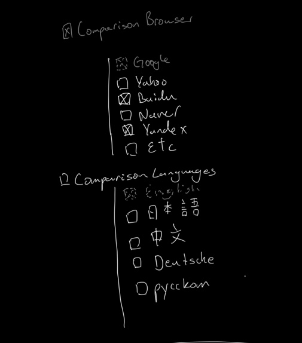
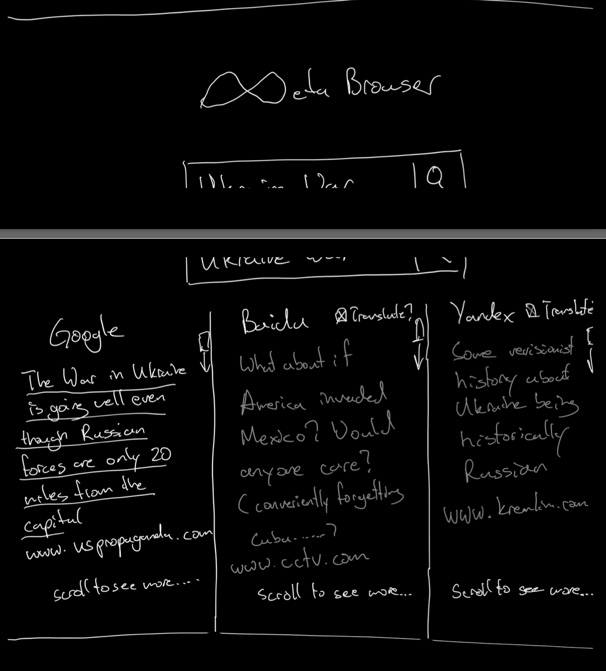
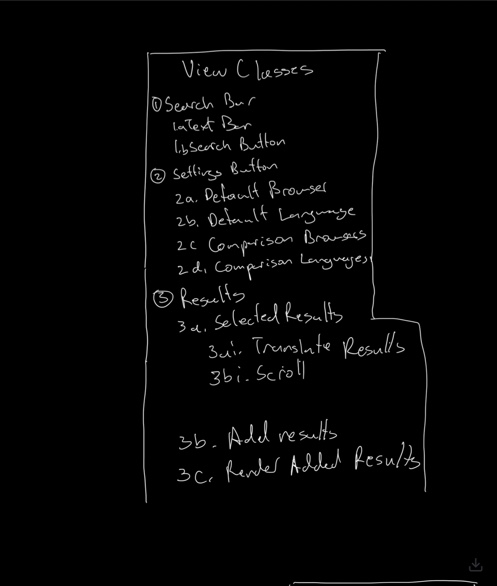

:warning: Everything between << >> needs to be replaced (remove << >> after replacing)
# CS110 Project Proposal
# << Project Title >>
## CS 110 Final Project
### Spring, 2022
### [Assignment Description](https://docs.google.com/document/d/1H4R6yLL7som1lglyXWZ04RvTp_RvRFCCBn6sqv-82ps/edit#)

<< [repl](#) >>

<< [link to demo presentation slides](#) >>

### Team:  MLA 
#### Luke Pawlicki, Mako Ikeda, Andrew Wang 

***

## Project Description *(Software Lead)*

This program takes a search term (in English) and searches that term on different browsers and in different languages and returns the most popular search results.
***    

## User Interface Design *(Front End Specialist)*

* << A wireframe or drawing of the user interface concept along with a short description of the interface. You should have one for each screen in your program. >>
    * For example, if your program has a start screen, game screen, and game over screen, you should include a wireframe / screenshot / drawing of each one and a short description of the components
    * 
    * GUI Draft v2
    * 
    * 
    * 

* << You should also have a screenshot of each screen for your final GUI >>

***        

## Program Design *(Backend Specialist)*

* Non-Standard libraries
    * << You should have a list of any additional libraries or modules used (pygame, request) beyond non-standard python. >>
    * For each additional module you should include
        * url for the module documentation
        * a short description of the module
* Class Interface Design
  *
  
     * Class Diagram v1
  *
      * 
    * This does not need to be overly detailed, but should show how your code fits into the Model/View/Controller paradigm.
* Classes
    * search bar(intext bar/search button)
    * setting button(default broser, default language, comparison browser, comparison languages)
    * results(selected results(translate results/scroll), add results, reader added results)

## Project Structure *(Software Lead)*

The Project is broken down into the following file structure:

* main.py
* src
    * <all of your python files should go here>
* assets
    * <all of your media, i.e. images, font files, etc, should go here)
    * First Draft of our GUI: https://replit.com/@lukepawlicki/final-project-mla#assets/First%20GUI%20Draft.jpg
* etc
    * <This is a catch all folder for things that are not part of your project, but you want to keep with your project. Your demo video should go here.>

***

## Tasks and Responsibilities *(Software Lead)*

   * You must outline the team member roles and who was responsible for each class/method, both individual and collaborative.

### Software Lead - Luke Pawlicki

<< Worked as integration specialist by... >>

### Front End Specialist - Mako Ikeda

<< Front-end lead conducted significant research on... >>

### Back End Specialist - Andrew Wang

<< The back end specialist... >>

## Testing *(Software Lead)*

* << Describe your testing strategy for your project. >>
    * << Example >>

## ATP

| Step         | Procedure       | Expected Results  | Actual Results| 
|:----------------------|:-------------:| -----------------:| -----------:|
| 1 | Click Run Button |Program starts, GUI with search bar appears on the screen  |    
|  2  | User types out texts  | display the texts in the search bar | 
| 3 | Click search button | Runs the web scraper, and the search results from the two search engines appear on the screen | 
| 4 | Press enter key | Same as clicking search button; runs the scraper |

