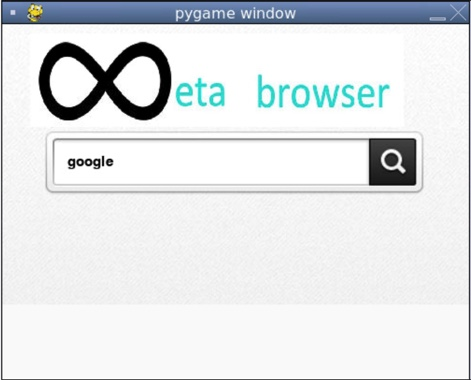

:warning: Everything between << >> needs to be replaced (remove << >> after replacing)
# CS110 Project Proposal
# Web Scraper
## CS 110 Final Project
### Spring, 2022
### [Assignment Description](https://docs.google.com/document/d/1H4R6yLL7som1lglyXWZ04RvTp_RvRFCCBn6sqv-82ps/edit#)

[repl](https://replit.com/join/aqhcnsdthp-lukepawlicki) 

<< [link to demo presentation slides](#) >>

### Team:  MLA 
#### Luke Pawlicki, Mako Ikeda, Andrew Wang 

***

## Project Description *(Software Lead)*

This program takes a search term (in English) and searches that term on different browsers and returns the most popular search results.
***    

## User Interface Design *(Front End Specialist)*

* Our GUI has one screen in which a user's input is shown in the searchbar, and the scraper runs when the user clicks the search button.
    * For example, if your program has a start screen, game screen, and game over screen, you should include a wireframe / screenshot / drawing of each one and a short description of the components
    * 
    * GUI Draft v2
    * 
    * 
    * 

* final GUI

***        

## Program Design *(Backend Specialist)*

* Non-Standard libraries
    * << You should have a list of any additional libraries or modules used (pygame, request) beyond non-standard python. >>
    * For each additional module you should include
        * url for the module documentation
        * a short description of the module
* Class Interface Design
  *
  
     * Class Diagram v1
  *
      * 
    * This does not need to be overly detailed, but should show how your code fits into the Model/View/Controller paradigm.
* Classes
    * search bar(intext bar/search button)
    * setting button(default broser, default language, comparison browser, comparison languages)
    * results(selected results(translate results/scroll), add results, reader added results)

## Project Structure *(Software Lead)*

The Project is broken down into the following file structure:

* main.py
* src
    * controller
    * metabrowser
    * scraping
    * searchbar
* assets
    * <all of your media, i.e. images, font files, etc, should go here)
    * First Draft of our GUI: https://replit.com/@lukepawlicki/final-project-mla#assets/First%20GUI%20Draft.jpg
* etc
    * <This is a catch all folder for things that are not part of your project, but you want to keep with your project. Your demo video should go here.>

***

## Tasks and Responsibilities *(Software Lead)*

   * You must outline the team member roles and who was responsible for each class/method, both individual and collaborative.

### Software Lead - Luke Pawlicki

Worked as integration specialist by monitoring work on the front end and back end to make sure that the two components worked together. Also scheduled weekly team meetings to complete the milestones and discuss work for the upcoming week. Collaborated with both the front and back end to construct the controller and models. 

### Front End Specialist - Mako Ikeda

Front-end lead conducted significant research on GUI design to make our GUI as user friendly as possible. Made sure that the controller was designed to work with the scraper models provided by the back end. 

### Back End Specialist - Andrew Wang

The back end specialist designed the scraper models that we used in the controller. Conducted research on python libraries that we did not use in class. Communicated with other group members about structure of the scraper models.

## Testing *(Software Lead)*

* We tested the project in two main ways. One way involved using separate repl files to test small portions of the code as we went. When we were getting toward the end of writing the code, we would test the code by commenting out the lines that weren't functioning yet to see if the rest worked.  
    * Before creating the scraper models, we tested that the scraper worked in a separate repl file, then changed it to fit inside a class. 

## ATP

| Step         | Procedure       | Expected Results  | Actual Results| 
|:----------------------|:-------------:| -----------------:| -----------:|
| 1 | Click Run Button |Program starts, GUI with search bar appears on the screen  |    
|  2  | User types out query  | Display the query in the search bar| 
| 3 | Click search button on screen Runs the web scraper, and the search results from different search engines for the same query appear on the screen | 
| 4 | User searches another query by modifying value in search box and presses search| Data from previous query is cleared and repeats steps 2 and 3|

